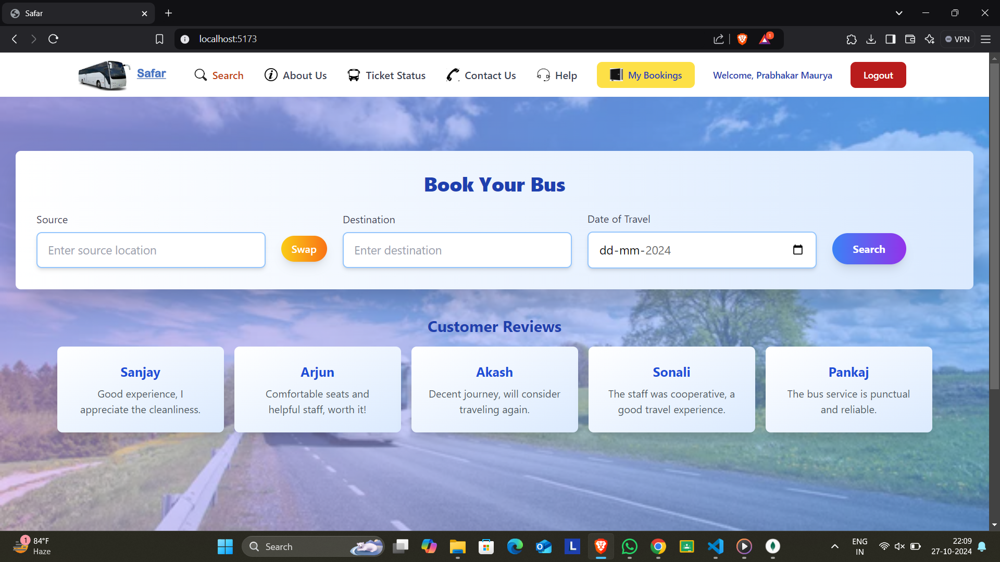
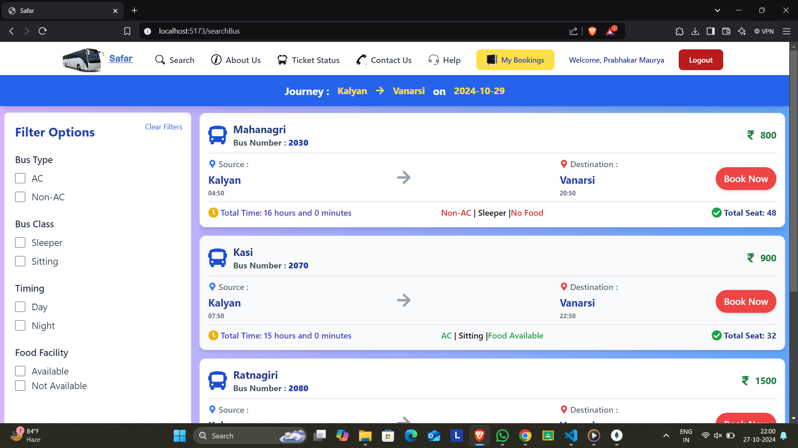
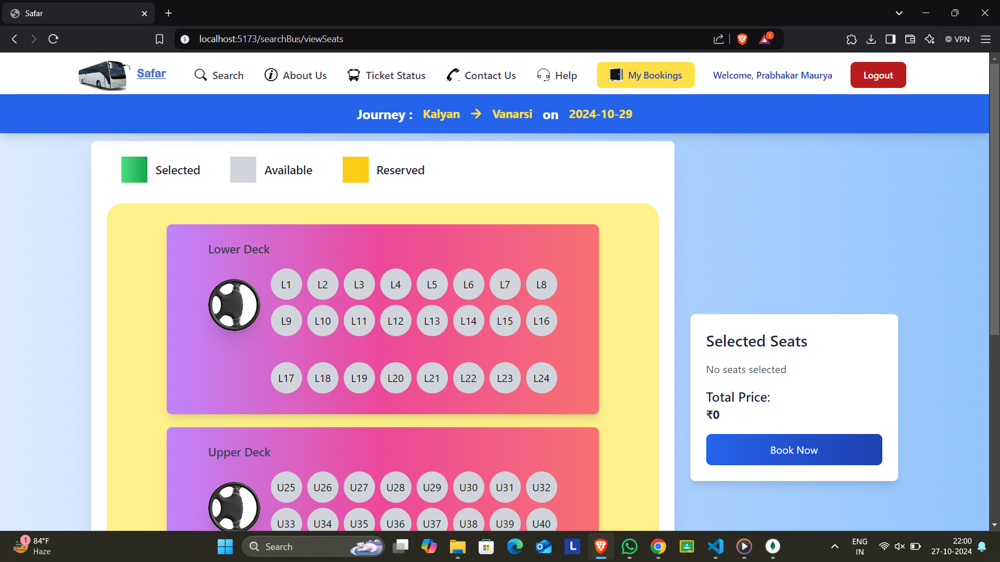
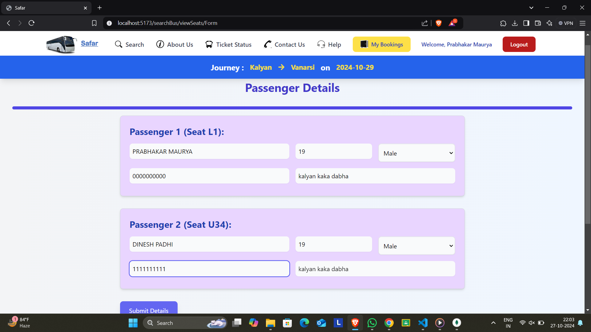
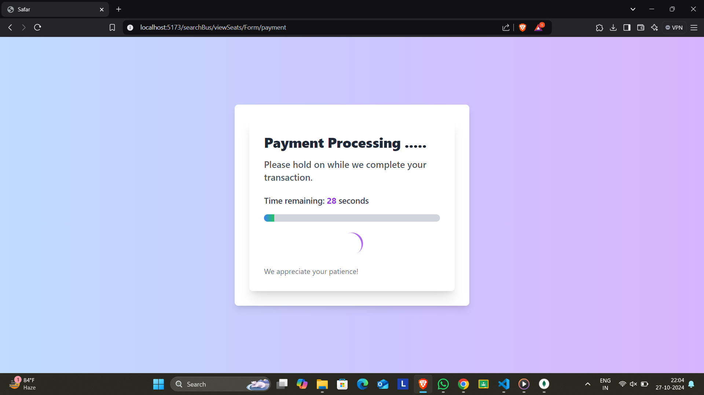
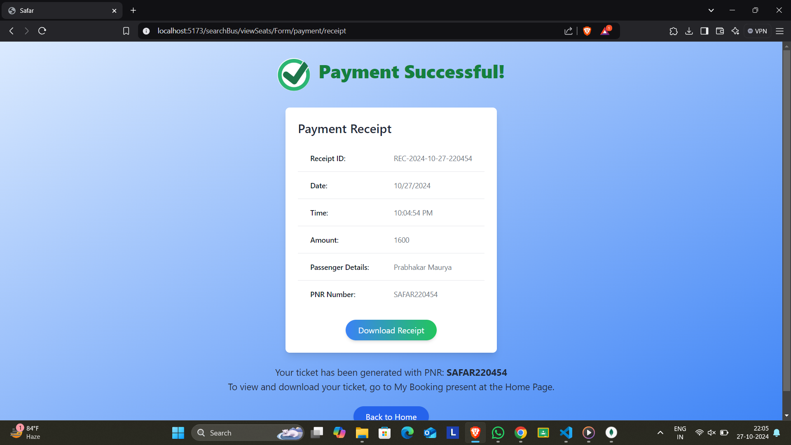
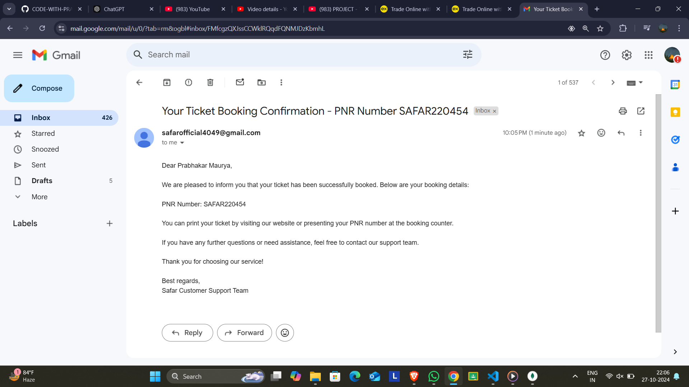
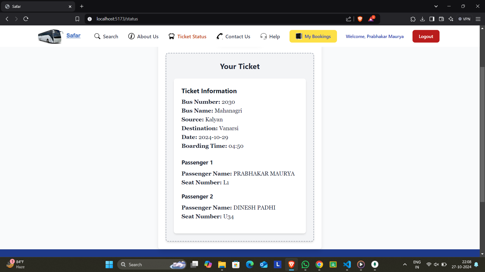
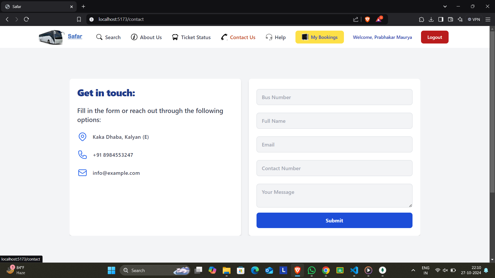
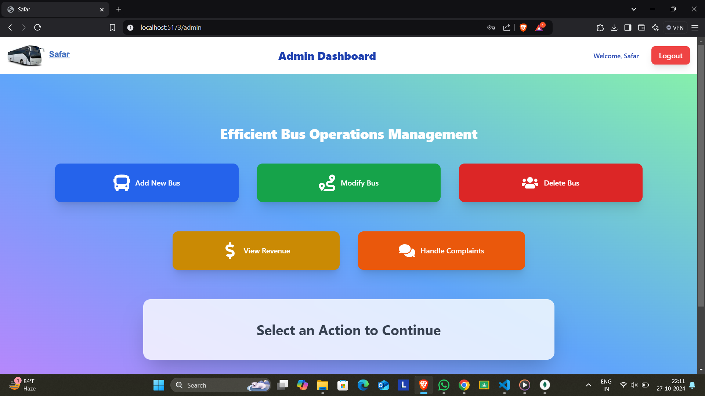

# SAFAR – BUS RESERVATION PORTAL (MERN)

## Overview
This is a MERN stack (MongoDB, Express.js, React, Node.js) bus booking application. It provides a robust solution for managing bus bookings with various features including secure login, OTP verification, and ticketing. The application aims to offer a seamless experience for users looking to book bus tickets online.

## Features

- **Token-Based Login**: Secure authentication using JWT (JSON Web Tokens) to ensure only authorized users can access certain features.
- **OTP Verification**: Users receive an OTP (One-Time Password) via email for account verification and to secure the login process.
- **Ticketing on Mail**: Tickets are sent to users via email upon successful booking, providing a convenient way to access and manage tickets.
- **Decryption**: Secure decryption of sensitive data for enhanced security.

## Installation

### Prerequisites

- Node.js and npm installed on your machine.
- MongoDB server running locally or remotely.
- An email service setup for sending OTPs and tickets (e.g., Nodemailer server).

### Setup

1. **Clone the Repository**

   ```bash
   git clone https://github.com/CODE-WITH-PRABHAKR/Safar-Bus_Booking_System.git
   cd Safar-Bus_Booking_System
   ```

2. **Install Dependencies**

   Navigate to the root of the project and install backend and frontend dependencies:

   ```bash
   # Backend
   cd Server
   npm install


   # Frontend
   cd ../Frontend
   npm install
3. **Run the Application**

   Start the backend server:

   ```bash
   cd Server
   npm start
   ```

   Start the frontend development server:

   ```bash
   cd ../Frontend
   npm run dev
   ```

   The frontend will be available at `http://localhost:5173` and the backend API at `http://localhost:8080`.


## Usage

1. **Login**: Users can log in using their credentials. JWT tokens are used for authentication and must be included in the `Authorization` header for protected routes.

2. **Booking**: Users can book tickets by providing necessary details such as source, destination, date, etc. Upon successful booking, an OTP will be sent for verification and the ticket will be emailed.

3. **Manage Bookings**: Users can view and manage their bookings through the application.

## Contributing

Feel free to contribute to this project by submitting issues, feature requests, or pull requests. Ensure that you follow the project's coding standards and guidelines.


## HOME PAGE


## BUS PAGE


## SEAT PAGE



## PASSENGER DETAILS PAGE



## PAYMENT



## RECEIPT



## BOOKING CONFORMATION ON MAIL



## TICKET



## CONTACT US



## ADMIN DASHBOARD



## Contact

For any questions or support, please contact [mauryaprabhakar677@gmail.com , dineshpadhi16@gmail.com].

